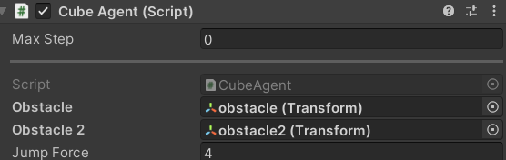
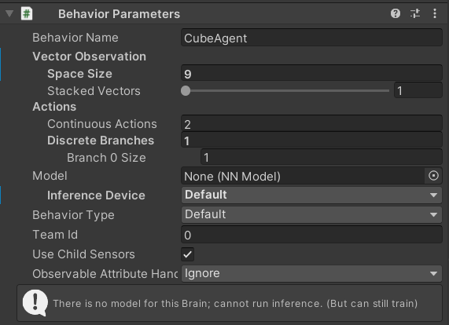

# Jumper

## Werkwijze

### unity omgeving aanmaken

voeg voor je begint ml-agent toe.

1. Maak een leeg object aan genaamd game
2. Voeg een cubus genaamd Agent toe
3. Voeg nog 2 cubussen toe gnaamd obstacle en obstacle2

het zou er zo uit moeten zien:

4. voeg het CubeAgent script toe aan de cubus Agent. geef deze ook een rigidbody en een decision requester.

5. voeg de twee obstacle's toe aan het script

6. bekijk zeker de behavior parameters

7. gebruik anaconda om naar de juiste map te gaan en de agent te kunnen trainen en om het yaml bestand van de agent te kunnen toevoegen / nakijken. het helpt om in het begin van de training de straf voor springen hoger te zetten.
8. dit is een voorbeeld resultaat van een training

